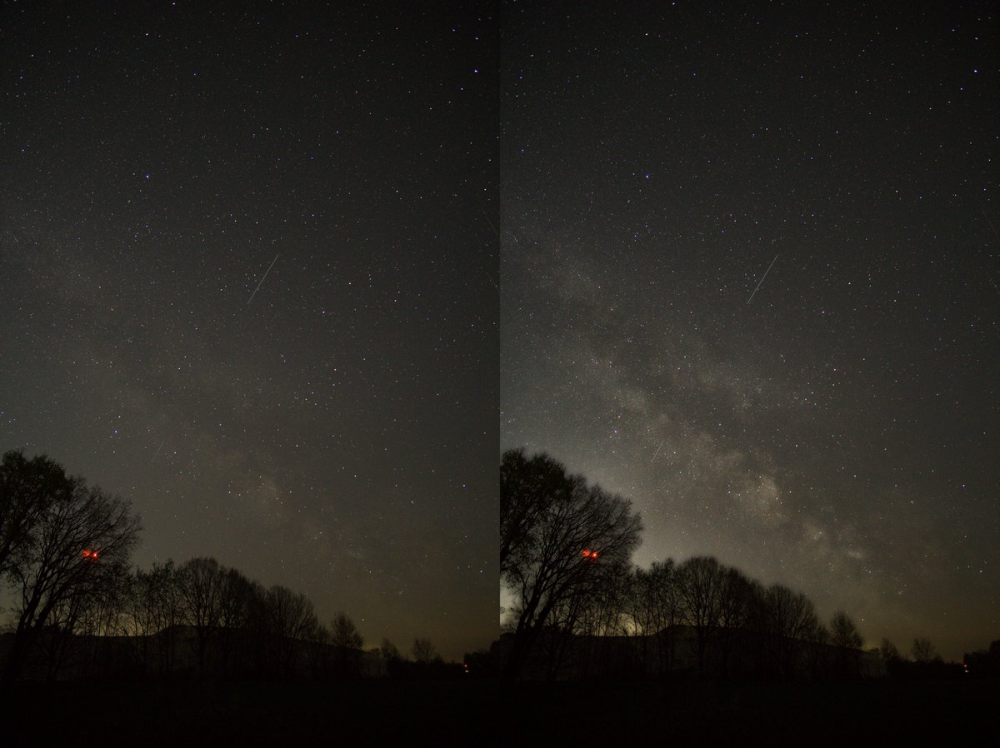
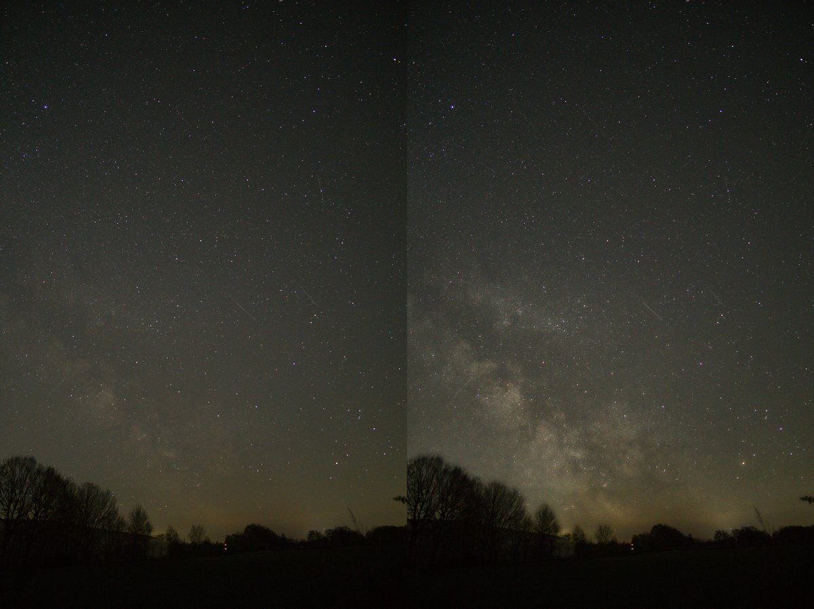

# Auto Milky Way

Reads in Sony RAW files, processes them using darktable CLI with auto settings, and outputs processed JPEGs.

## Goals
Make the Milky Way in the photos more visible and create astonishing photos. But otherwise the image should remain natural.

## Before and after

